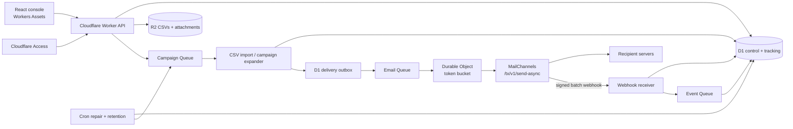

# MailChannels + Cloudflare Mass Email System

A semantic Cloudflare-native implementation of AWS's [Sample Mass Email System](https://github.com/aws-samples/sample-mass-email-system). It preserves the original system's product shape—recipient CSVs, reusable templates, ad hoc sends, asynchronous campaigns, batching, attachments, and per-recipient monitoring—while replacing its service primitives:

| AWS sample | This project |
|---|---|
| Amazon SES | MailChannels Email API `send-async`, native Mustache rendering, unsubscribe handling, suppressions, and signed webhooks |
| Lambda + API Gateway | Cloudflare Workers |
| Step Functions + EventBridge | Queue job state stored in D1, Cloudflare Queues, and Cron Triggers |
| SQS + dead-letter queues | Cloudflare Queues + configured DLQs |
| DynamoDB | Cloudflare D1 |
| S3 | Cloudflare R2 |
| Cognito | Cloudflare Access |
| WAF + CloudFront | Cloudflare WAF/CDN + Workers Assets |
| SES send-rate controls | A Durable Object global token bucket + Queue concurrency |

This is a demonstration, not a production-ready bulk-mail product. You are responsible for recipient consent, anti-spam compliance, sender authentication, abuse prevention, data retention, and a load test that reflects your Cloudflare and MailChannels plans.

## What it demonstrates

- A React operator console for campaigns, templates, recipient lists, ad hoc sends, and live delivery status.
- Resumable, range-based CSV imports from R2 into D1. The parser supports quoted fields, quoted newlines, CRLF, escaped quotes, and UTF-8 split across chunks.
- Campaign fan-out through Cloudflare Queues without loading an entire audience into one Worker invocation.
- A D1 outbox that closes the database-to-queue loss window. Consumers are idempotent at the D1 boundary.
- One MailChannels async request per recipient, giving every tracked recipient an unambiguous `request_id`.
- Native MailChannels Mustache content using `dynamic_template_data` from each CSV row.
- Native non-transactional unsubscribe behavior when a campaign has **Marketing unsubscribe** enabled.
- Signed MailChannels webhook validation (content digest, five-minute replay window, Ed25519 public-key verification), immediate durable storage, and asynchronous event processing.
- Per-recipient processed, delivered, hard-bounced, complained, open, click, unsubscribe, and failure state.
- Automatic local suppression mirroring for hard bounces, complaints, and unsubscribes. MailChannels remains the delivery-time source of truth for suppression.
- Exact account-level send-rate control via a Durable Object token bucket, even while Queue consumers autoscale.
- Retry queues, DLQs, repair sweeps, stuck-send leases, raw webhook retention, and granular tracking expiry.

## Architecture



Read [docs/architecture.md](docs/architecture.md) for invariants, failure handling, and differences from the AWS implementation.

## CSV format

The importer recognizes these headers (case, spaces, `_`, and `-` are ignored):

```csv
email,first_name,last_name,topics,company,plan
alice@example.net,Alice,Ng,"newsletter;customers",Acme,pro
bob@example.net,Bob,Diaz,newsletter,Globex,starter
```

Every column is retained in `data_json` and can be used in a MailChannels Mustache template. Standard aliases are also supplied: `email`, `firstName`, `lastName`, and `topics`.

```html
<h1>Hello {{firstName}}</h1>
<p>Your {{company}} account is on the {{plan}} plan.</p>
```

## Local development

Requirements: Node.js 22+ and a Cloudflare account for full binding integration.

```bash
npm install
cp .env.example .dev.vars
npm run db:migrate:local
npm run build
npx wrangler dev
```

For the Vite UI with hot reload, run `npm run dev` separately. Vite proxies `/api` and `/webhooks` to Wrangler on port 8787.

`AUTH_MODE=development` accepts `X-Dev-User-Email` and defaults to `developer@local.test`. Never deploy with development authentication.

## Cloudflare deployment

1. Create the backing resources:

   ```bash
   npx wrangler d1 create mass-email-system
   npx wrangler r2 bucket create mass-email-system-content
   npx wrangler queues create mass-email-campaigns
   npx wrangler queues create mass-email-delivery
   npx wrangler queues create mass-email-events
   npx wrangler queues create mass-email-campaigns-dlq
   npx wrangler queues create mass-email-delivery-dlq
   npx wrangler queues create mass-email-events-dlq
   ```

2. Put the D1 UUID from the first command into `database_id` in `wrangler.jsonc`. Set `ALLOWED_EMAIL_DOMAIN`, `ALLOWED_SENDER_DOMAINS`, `CF_ACCESS_TEAM_DOMAIN`, `CF_ACCESS_AUD`, and the desired `EMAIL_RATE_LIMIT`.

3. Store secrets. Do not put either value in `wrangler.jsonc`:

   ```bash
   npx wrangler secret put MAILCHANNELS_API_KEY
   npx wrangler secret put MAILCHANNELS_CUSTOMER_HANDLE
   ```

4. Apply the schema and deploy:

   ```bash
   npm install
   npm run check
   npm run db:migrate:remote
   npm run deploy
   ```

5. Put the deployed hostname behind a Cloudflare Access self-hosted application. The Access application audience must match `CF_ACCESS_AUD`.

6. Configure MailChannels:

   - Add Domain Lockdown for each sending domain.
   - Publish SPF, DKIM, and DMARC.
   - Enroll `https://YOUR_HOST/webhooks/mailchannels` as the account webhook.
   - Run the MailChannels webhook validation action and confirm a `202` response.

MailChannels currently permits one webhook per account. The receiver checks `customer_handle`, so set it to the exact account (or sub-account) handle whose events this deployment accepts.

## Configuration

| Setting | Default | Purpose |
|---|---:|---|
| `EMAIL_RATE_LIMIT` | `50` | Global MailChannels requests/second enforced by the Durable Object. |
| `CAMPAIGN_PAGE_SIZE` | `250` | D1 recipients copied into the campaign ledger per expansion job. |
| `IMPORT_CHUNK_BYTES` | `524288` | R2 bytes parsed per resumable import job; capped in code at 2 MB. |
| `TRACKING_RETENTION_DAYS` | `400` | Granular recipient and raw webhook retention; campaign summaries remain. |
| `ALLOWED_SENDER_DOMAINS` | `example.com` | UI/API guardrail. MailChannels Domain Lockdown is authoritative. |
| `ALLOWED_EMAIL_DOMAIN` | `example.com` | Additional operator-email restriction after Access JWT validation. |
| `WEBHOOK_VERIFY_SIGNATURES` | `true` | Must stay true outside deliberately isolated local tests. |

Queue `max_concurrency`, retry count, and DLQs are configured in `wrangler.jsonc`.

## API compatibility

The main resource shape follows the AWS sample under `/api`: `templates`, `send-email`, `campaigns`, `recipients-lists`, `generate-upload-url`, `topics`, and campaign detail/search. R2 upload tickets point back to an authenticated Worker `PUT` route instead of exposing R2 credentials or S3-compatible presigned URLs.

See [docs/api.md](docs/api.md) for request bodies and responses.

## Delivery semantics

Cloudflare Queues provide at-least-once delivery. D1 claims and unique keys prevent duplicate queue messages from normally calling MailChannels twice. There is still an unavoidable distributed-systems edge: a Worker can terminate after MailChannels accepts a request but before D1 records its `request_id`. Retrying that recipient can send a duplicate because the Email API does not expose an idempotency-key contract. Production senders should assess this risk, monitor stuck leases/DLQs, and reconcile with MailChannels events before replaying ambiguous sends.

## Verification

```bash
npm run check
npm run build
```

The unit suite covers chunked CSV parsing, request validation helpers, and delivery-event behavior. Build and TypeScript checks validate both Worker and React code.

## License

MIT No Attribution (MIT-0). See [LICENSE](LICENSE). This repository is an independent semantic implementation; it does not copy the AWS sample's source code or branding.
