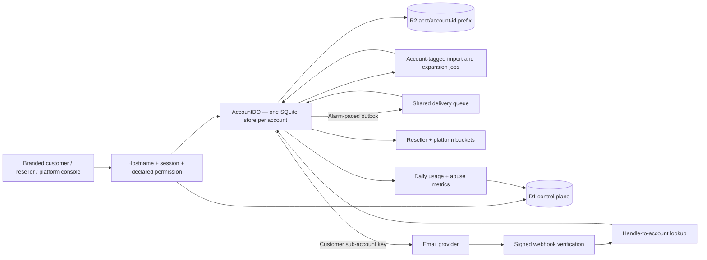

# Architecture and invariants

The [multi-tenancy plan](multi-tenancy-plan.md) describes the product decisions. This document describes the implementation through Phase 6.

## Isolation and identity

- The Worker resolves every hostname before serving APIs or assets. A configured platform hostname is the only bootstrap exception; unknown customer hosts return 404.
- Customer handlers receive `TenantContext`, including an account-local SQL store. They cannot query the control-plane database as a tenant store. `AccountDO` owns the SQLite adapter and lazy numbered migrations.
- Queue messages require `accountId`. Consumers look up the account and select its jurisdiction before dispatching. Unknown jobs fail rather than silently succeeding.
- R2 uploads use `acct/{accountId}/...`. Upload tickets are stored inside the owning AccountDO; guessing another account's ticket or resource ID cannot cross the object boundary.
- The local SQL adapter preserves repeated numbered bindings and provides synchronous atomic batches inside `storage.transactionSync()`.
- Account requests and alarms serialize across asynchronous work. Deletion first marks the control-plane account `DELETING`, then waits for the object to quiesce before removing provider data, objects and tenant storage.

Sessions are random bearer IDs, hashed in D1 and sent in `__Host-session` cookies (`Secure`, `HttpOnly`, `SameSite=Lax`, no Domain). Magic links and SSO nonces are one-use. Cookie-authenticated writes require a same-origin request; upload-ticket creation receives the same protection despite its legacy GET route.

Platform requests require a verified Cloudflare Access JWT, including issuer and audience. Reseller OIDC uses authorization code, PKCE, state bound to a browser cookie, nonce, signature/issuer/audience/expiry checks, verified email and an existing reseller invitation. Panel SSO uses a short-lived signed envelope bound to reseller, account and hostname.

Permissions are declared in code and fail closed. Scope roles do not implicitly become customer roles. Support access creates a 60-minute session with the real actor and effective account user; it denies user management, export and deletion. The actor's current role is rechecked. Writes record both identities.

## Provisioning and credentials

A reseller is linked to an externally created MailChannels parent. Listing sub-accounts validates the supplied management key before it is stored with AES-GCM encryption. Customer sends never fall back to a parent or global key.

Provisioning journals the account and idempotency key, takes a retry lease, chooses a deterministic child handle, and advances through child creation, key issuance, mandatory webhook enrollment, sending limit and tracking-domain setup. A failure records an alert and suspends the partial child; retry resumes saved progress. Key persistence failures revoke the newly issued key. A successful retry activates the child only after its mandatory setup steps succeed.

Reseller integration keys are hashed, scope-limited and revocable. Panel and callback shared secrets, OIDC client secrets, parent keys and sending keys are encrypted. API and audit responses exclude credential values, except newly created integration credentials returned once to their owner.

## Delivery and fairness

Campaign expansion snapshots only email and source recipient ID. Merge fields are loaded from the source row at send time. Per-account alarms release a bounded number of outbox rows each second, so the remainder of a large campaign stays in its own object. Consumers also enforce reseller and platform ceilings.

New accounts begin at at most five messages/second and 1,000 monthly messages, bounded by their plan. The rate and volume allowance rise to the plan after at least 1,000 accepted messages, seven days of age and no complaint history. Contact limits, mandatory consent attestation, address syntax, deduplication and hygiene flags are enforced on import.

Sends claim a recipient conditionally before calling the provider. Acceptance/failure and campaign/batch counters are committed atomically. Duplicate queue jobs therefore do not normally issue a second send. Ambiguous network/server responses remain `SENDING`; repair adopts a matching `processed` event before considering a retry. After a one-hour grace period, one retry is allowed; a second ambiguity becomes `UNCONFIRMED`. The provider has no idempotency-key guarantee, so the residual crash-plus-lost-webhook duplicate window remains.

Campaigns are always non-transactional and include the account postal address and a signed unsubscribe link. Campaign attachments are disabled. Test messages are limited to verified account members and have a separate small rate bucket. Both campaign and test sends require an active account and a verified sender domain.

## Events, tracking and abuse

Signature verification precedes routing by `customer_handle`. Known events are durably stored in the account object, with raw payloads under its R2 prefix; unknown handles become operator alerts. Event fingerprints deduplicate callbacks. Operators can replay unknown-handle alerts after fixing the mapping.

Tracking activation registers the customer's own click/open domains, returns exact TXT/CNAME records, and uses a platform bucket of one new hostname per minute (180 per three hours). The first HTTPS request warms the certificate; both scopes can reuse that warm hostname. Tracking remains disabled until both scopes are active.

One-click unsubscribe records the local suppression before attempting provider mirroring. A durable pending marker retries a failed mirror from the alarm. Hard bounces and complaints also suppress locally. A sliding 24-hour window with at least 100 accepted recipients triggers a pause at a 0.1% complaint rate or 5% hard-bounce rate. The first breach flags the account; a subsequent distinct breach after operator resumption suspends its provider sub-account.

## Operations and lifecycle

The platform console exposes accounts/resellers, staff, plans, global search, health alerts, provisioning retries, failed-job inspection/replay, abuse actions and usage export. Daily account totals are persisted separately from expiring recipient rows. Reseller rollups aggregate those totals. Provider billing-period snapshots are displayed separately; they are not mislabeled as daily usage.

Maintenance processes bounded, rotating account batches and records per-account failures instead of aborting the whole fleet. Account alarms perform pacing, repair, suppression mirroring and daily retention. Cron checks for stalled alarms and handles control-plane provisioning, callbacks, metering and hostname revalidation.

Retention defaults to 90 days and can be set to 7–365 days per account. Detailed campaign-recipient rows and raw webhook events expire; daily metering and campaign summaries remain. Contacts and original lists remain until explicitly deleted. Export streams JSON in bounded pages. Deletion removes the provider child, account R2 prefix, Durable Object contents, domain/provisioning/role/session records and encrypted child key. A redacted account tombstone and usage/audit records remain for non-PII routing/accounting continuity.

Phase 7 remains responsible for live integration checks, external penetration testing, fleet-scale load testing and the hosting-provider pilot. Local TLS/DNS doubles establish application behavior, not real certificate or DNS issuance.
