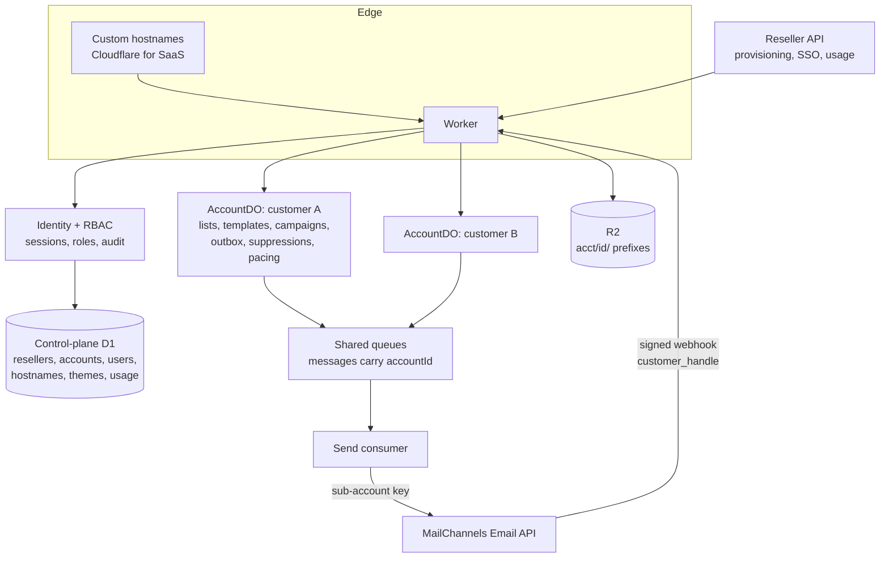

# White-label multi-tenancy plan

Status: proposal, 2026-10-02. Nothing in this document is implemented yet.

This plan turns the single-tenant sample into a three-tier, white-labelled email marketing service hosted on Cloudflare:

| Tier | Who | Scope |
|---|---|---|
| **Platform** | MailChannels staff | Everything. Operates the service, onboards resellers, handles abuse and billing. |
| **Reseller** | Web hosting providers | Their own customer accounts, branding, hostname, and support access into those accounts. |
| **Account** | Hosting customers | Their own lists, templates, campaigns, sender domains and users. |

## 1. Starting point

The current code is single-tenant by construction. The relevant facts:

- No table has a tenant column (`migrations/0001_initial.sql`). `templates` is keyed by `name` and `suppressions` by `email`, both globally.
- There is no user, role or session model. `requireUser` returns an email string that is used only by `GET /api/me`. Every authenticated user can call every route.
- Auth is one Cloudflare Access application plus one allowed email domain.
- One `MAILCHANNELS_API_KEY`, one customer handle, one `ALLOWED_SENDER_DOMAINS` variable, one global rate limiter (`mailchannels-global`).
- The webhook receiver rejects any event whose `customer_handle` differs from the single configured handle.
- `flushOutbox` and `repair` scan the whole database, so one large campaign delays every other sender.
- Branding and MailChannels/Cloudflare product copy are hardcoded in `src/web/App.tsx` and `index.html`.
- `package.json` pins every dependency to `latest`.

What carries forward unchanged in shape: resumable CSV import, cursor-based campaign expansion, the outbox, idempotent per-recipient claims, webhook signature verification, and the repair sweep.

## 2. Decisions

These are the choices the rest of the plan depends on. Section 9 records the answers MailChannels gave to the questions they raised.

### 2.1 Data isolation: one Durable Object per account

**Recommendation:** a small shared control-plane D1 database, plus one SQLite-backed Durable Object (`AccountDO`) per end-customer account that holds all of that account's data.

| Option | For | Against |
|---|---|---|
| `tenant_id` column in the shared D1 | Fastest to ship; SQL stays as is | One missed `WHERE` clause leaks data across customers. The single-database size cap is shared by all tenants. Global scans stay global. |
| One D1 database per account | Strong isolation | Worker D1 bindings are static, so per-account databases can only be reached through the REST API. Not workable on the hot path. |
| **One Durable Object per account** | Isolation is structural: code running for account A has no handle to account B's rows. Size cap applies per account. Deleting an account is deleting its object. Supports per-account jurisdiction (EU). Rate limiting and repair become per-account. | Every SQL call site is ported from the D1 API to the Durable Object SQL API. No cross-account SQL, so platform and reseller reporting needs rollups. Schema migrations run per object. |

Consequences of this choice:

- Control-plane D1 holds resellers, accounts, users, role assignments, hostnames, themes, API keys, the handle-to-account routing table, usage rollups and the audit log.
- R2 keys gain an account prefix: `acct/{accountId}/recipient-lists/...`.
- Queue messages carry `accountId`. Consumers resolve the `AccountDO` and call it; they never touch tenant data directly.
- `campaign_recipients.data_json` currently copies every recipient's full row into every campaign. Under a per-account size cap this must go: snapshot only `email` and the list row id, and read merge data from `recipients` at send time.

### 2.2 MailChannels account mapping: parent per reseller, sub-account per customer

MailChannels sub-accounts give each one its own API keys, sending limit, suppression list, webhook and usage reporting, and can be suspended individually. Sub-accounts cannot be nested.

**Decided:** one MailChannels parent account per reseller, one sub-account per end-customer account.

- The parent account's limit is a hard ceiling over all of its sub-accounts, which is exactly a reseller's plan.
- Sub-account limits map to an end customer's plan.
- One reseller's abuse or quota exhaustion cannot affect another reseller.

Parent accounts are created outside this service, when the hosting provider is sold the product. This service does not create them. It is told about them:

- **Link a reseller:** `POST /api/platform/resellers`, also available as a form in the platform console. The caller supplies the reseller's name, plan, the Email API parent account handle, and an API key drawn on that parent account.
- **Validation before storing:** call the Email API with the supplied key (list sub-accounts) and reject the request if the key does not work or lacks the sub-account feature. Store the key encrypted.
- **Rotate the key:** `PUT /api/platform/resellers/{id}/mailchannels-key`. Same validation.
- **Permission:** platform `admin` or `owner`; every call is audit-logged without the key value.

From then on the service uses the parent key only for management: creating, limiting, suspending and deleting sub-accounts and issuing their keys. Sending always uses the end customer's own sub-account key.

Sub-accounts should be created as service sub-accounts (no console user, managed by the parent, initial `sending_limit` set at creation). That feature is on the `feat/service-subaccounts` branch of `transactional-api` and will reach `master` when this product is released for early testing. Development before then creates an ordinary sub-account and sets the limit with a second call.

### 2.3 Identity: own sessions, three ways in

Cloudflare Access cannot serve customer logins on reseller-owned hostnames. Build a session layer in the Worker.

| Who | How they sign in |
|---|---|
| Platform staff | Cloudflare Access on the platform admin hostname. The existing `src/worker/auth.ts` is reused for this only. |
| Reseller staff | OIDC against the reseller's identity provider where they have one; email magic link otherwise. |
| End customers | Single sign-on handoff from the hosting control panel (a short-lived token signed with the reseller's API secret); email magic link as the fallback. |

Sessions are opaque IDs in a host-only, `HttpOnly`, `Secure`, `SameSite=Lax` cookie, stored in the control-plane database. Because cookies are host-only, a session on one reseller's hostname is never sent to another's. Passwords and TOTP are deferred; magic links and panel SSO cover launch.

### 2.4 Authorisation: scoped role assignments, permissions in code

One table: `role_assignments(user_id, scope_type, scope_id, role)` where `scope_type` is `platform`, `reseller` or `account`. A role is a named set of permissions defined in code. Every route declares the permission it needs; a route with no declaration fails closed.

| Scope | Role | Can |
|---|---|---|
| Platform | `owner` | Everything, including staff role management |
| Platform | `admin` | Manage resellers, plans, hostnames |
| Platform | `support` | Read everything; impersonate into any reseller or account |
| Platform | `compliance` | Suspend and resume senders; view content and complaint data |
| Platform | `billing` | Plans, limits, usage export |
| Reseller | `owner` | Everything in the reseller, including staff and API keys |
| Reseller | `admin` | Create, suspend and delete accounts; branding; hostname |
| Reseller | `support` | View accounts; impersonate into them |
| Reseller | `billing` | Usage and plan assignment only |
| Account | `owner` | Everything in the account, including users |
| Account | `admin` | Users, sender domains, settings |
| Account | `marketer` | Lists, templates, campaigns, including sending |
| Account | `author` | Create and edit drafts; cannot send or export contacts |
| Account | `viewer` | Read-only reports |

### 2.5 Impersonation ("ghosting")

- Support staff start an impersonation session against a target account, giving a reason.
- The session records both the real actor and the effective account. It is time-boxed (60 minutes) and capped at the account `admin` role: no user management, no contact export, no account deletion.
- The UI shows a persistent banner. Every write during the session is audit-logged with both identities.
- Reseller staff can only enter accounts under their own reseller. Platform staff can enter any.
- Account owners can see the impersonation history for their account.

### 2.6 White-labelling

- **Hostnames:** Cloudflare for SaaS custom hostnames. The reseller points a CNAME at the platform; a `hostnames` table maps host to reseller. Unknown hosts get a 404, never a default tenant.
- **Theme:** design tokens first (colours, fonts, radius, logo, favicon, product name, support link). `src/web/styles.css` already uses CSS variables, so tokens map on directly. The Worker injects the theme into `index.html` so there is no unbranded flash.
- **Custom stylesheet:** an optional advanced override, size-capped and sanitised (no `@import`, no external `url()`). It only ever applies on that reseller's own hostnames.
- **Assets:** stored in R2 and served same-origin, so the current `default-src 'self'` policy stays.
- **Product copy:** remove MailChannels and Cloudflare names, the Setup page and the architecture diagram from the customer UI. They move to the platform console.
- **Links in sent mail:** see 2.7.
- **System email:** invites and magic links are sent from the reseller's domain with the reseller's branding.

### 2.7 Tracking links and unsubscribe

Checked against `transactional-api` (master, 2026-09-29), `tracking-edge` (main, 2026-08-31) and `licensing-service`.

**How the services fit together**

1. A customer registers a tracking domain through the Email API (`POST /tx/v1/custom-tracking-domains`). The Email API checks the licence, asks `tracking-edge` for an ownership nonce, checks the TXT record at `_mailchannels-verify.{hostname}` and the CNAME to `links.mailchannels.net`, then stores the domain in `tracking-edge`.
2. `tracking-edge` stores each domain as `(customer_handle, name, hostname, scope)`, where scope is `click`, `open` or `unsubscribe`. It issues a Let's Encrypt certificate on the first TLS handshake for a registered hostname whose owner is licensed.
3. At send time the caller names a domain in `tracking_settings` or `unsubscribe_settings`. The Email API looks that name up under the sending account's own handle and rewrites links to use the hostname.
4. `tracking-edge` serves the click redirect, open pixel and unsubscribe page, and publishes the events that become webhooks.

**What this means for the plan**

- **Scope is per sub-account. Confirmed.** Registration and send-time lookup both use the handle of the account whose key made the call. A sub-account key registers and uses domains under the sub-account's handle.
- **A sub-account cannot use its parent's domains.** The send-time lookup uses only the sending account's handle, with no fallback to the parent. A reseller cannot register one tracking hostname and have all of its customers use it.
- **Sharing one hostname across sub-accounts is allowed but impractical.** Uniqueness is per `(handle, hostname, scope)`, so several sub-accounts can register the same hostname, but each gets its own nonce and each nonce needs its own TXT value on the same record.
- **Entitlement comes from the sub-account's own subscription.** Every sub-account is subscribed to the `email-api-sub` plan, not the parent's plan. That plan enables custom tracking domains (confirmed by MailChannels, 2026-10-02).
- **The hosted unsubscribe page is MailChannels-branded** even on a custom domain: a "Unsubscribe powered by MailChannels" footer with logo, the MailChannels favicon, and `support@mailchannels.com` in error text. It shows the sub-account's company name; a sub-account without one shows the literal text `<company_name>`.
- **Unsubscribe events carry the sub-account handle**, and the suppression is recorded against that sub-account.

**Decisions**

- **Unsubscribe: host it in this service.** The Email API uses a caller-supplied `List-Unsubscribe` header in place of its own. The Worker sets `List-Unsubscribe` and `List-Unsubscribe-Post` to a signed URL on the reseller's hostname, serves a page in the reseller's theme, records the suppression in the account's store, and pushes it to the sub-account's MailChannels suppression list. Templates use the service's own `{{unsubscribe_url}}` merge field. This removes the MailChannels branding without depending on a `tracking-edge` change, needs no extra DNS from the customer, and leaves room for a preference centre.
- **Click and open tracking: one tracking subdomain per end customer, under the reseller's domain.** For a reseller on `reseller.example`, each customer gets a hostname such as `customer-123.reseller.example`, registered with that customer's sub-account key for the `click` and `open` scopes. One ownership record covers both scopes. The end customer does no DNS work for this; the reseller does. A hostname per customer is also good domain hygiene: one customer's link reputation does not rub off on another's.
- **The reseller enables the DNS.** Each reseller sets a hostname pattern (for example `{account}.reseller.example`). For every new account the service needs two records:
  - a TXT record at `_mailchannels-verify.{hostname}` holding that sub-account's nonce. This is unique per customer and cannot be a wildcard.
  - a CNAME from `{hostname}` to `links.mailchannels.net`. A single wildcard CNAME on the reseller's zone can cover every customer.
- **How the reseller is told.** The provisioning API response and an outbound `tracking_domain.pending` webhook carry the exact records to create. The reseller's automation creates them and calls a verify endpoint; the service also retries on a backoff. A later option is for the reseller to delegate a subzone to a Cloudflare zone this service manages, so the records are created with no reseller automation.
- **No tracking domain, no tracking.** Until a customer's tracking domain is verified, click and open tracking stay off for that account so no shared MailChannels hostname appears in links. Resellers can relax this per plan.
- **Later: parent fallback.** If the Email API gains the ability for sub-accounts to use the parent account's tracking domain, a reseller-wide hostname becomes a second option. The plan does not depend on it.
- **DKIM covers the unsubscribe header.** The Email API assembles the full message, including caller-supplied headers, and then signs it (confirmed by MailChannels, 2026-10-02), so one-click unsubscribe with a self-hosted URL meets mailbox-provider requirements.

## 3. Target architecture



### Request path

1. Resolve the hostname to a reseller. Reject unknown hosts.
2. Resolve the session to a principal: user, role assignments, and the active account or reseller.
3. Check the route's declared permission against the principal and the target resource.
4. Dispatch. Account routes call that account's `AccountDO`; reseller and platform routes use the control-plane database.
5. Write an audit record for every mutation.

### Send path and fairness

The current design enqueues the whole outbox and throttles at the consumer, which lets one tenant fill the queue. Change where the throttle sits:

- Each `AccountDO` releases outbox rows to the delivery queue at its own permitted rate, driven by a Durable Object alarm. A tenant's backlog waits inside its own object, not in the shared queue.
- The consumer receives `{ accountId, campaignRecipientId }`, asks the `AccountDO` to claim the row and return the payload, sends with that account's sub-account key, and reports the result back.
- A per-reseller and a platform-wide ceiling remain as coarse token buckets.
- The repair sweep becomes the same per-account alarm. The global cron only finds accounts whose alarm has stalled.

### Webhook path

- Each sub-account enrols its own webhook, all pointing at the one platform endpoint. Signature verification is unchanged.
- The receiver looks up `customer_handle` in the control-plane routing table and forwards each event to the owning `AccountDO`. Unknown handles are stored and alerted on, not dropped.
- Suppressions are recorded per account. MailChannels already keeps a separate suppression list per sub-account, so the local table is a mirror.

### Control-plane schema (outline)

```text
resellers          id, name, status, plan_id, mc_parent_handle, mc_parent_key_ref, created_at
accounts           id, reseller_id, name, status, plan_id, mc_handle, mc_key_ref,
                   jurisdiction, created_at
users              id, email, name, status, created_at
role_assignments   user_id, scope_type, scope_id, role
sessions           id, user_id, hostname, actor_user_id, effective_scope, expires_at
hostnames          hostname, reseller_id, cf_custom_hostname_id, status
themes             reseller_id, tokens_json, css_object_key, logo_object_key, version
sender_domains     id, account_id, domain, dkim_selector, lockdown_ok, dkim_ok, spf_ok, verified_at
tracking_domains   id, account_id, name, hostname, scope, verify_token, status
api_keys           id, reseller_id, key_hash, scopes, last_used_at, revoked_at
plans              id, scope_type, monthly_sends, contacts, features_json
usage_daily        scope_type, scope_id, day, accepted, delivered, bounced, complained
audit_log          id, at, actor_user_id, impersonating, scope_type, scope_id, action, target, detail_json
```

MailChannels API keys are stored encrypted (AES-GCM with a key held as a Worker secret); `*_key_ref` points at the ciphertext row.

## 4. Phases

Each phase ends in something that can be demonstrated and tested on its own.

### Phase 0: Decisions and spikes

- Spike: port the list-import flow to an `AccountDO` and measure it against the D1 version.
- Spike: one custom hostname through Cloudflare for SaaS, end to end, with a themed `index.html`.
- Pin every dependency in `package.json`.

**Exit:** decisions in section 2 confirmed or changed in writing; both spikes working.

### Phase 1: Tenancy in the core

- Control-plane migration with `resellers` and `accounts`. Seed one of each.
- `AccountDO` with its own schema and lazy per-object migrations. Port templates, lists, recipients, attachments, campaigns, outbox and suppressions.
- Introduce a `TenantContext` that every handler and queue consumer must receive; remove direct use of `env.DB` for tenant data.
- Add `accountId` to all queue message types. Prefix R2 keys.
- Stop copying `data_json` into `campaign_recipients`.
- Isolation test harness: two accounts in one deployment; for every route, assert that account A's session cannot read, list, modify or infer account B's resources.

**Exit:** two seeded accounts run campaigns side by side with no shared rows, and the isolation suite passes. Still behind Cloudflare Access, still one MailChannels key.

### Phase 2: Identity and RBAC

- `users`, `sessions`, `role_assignments`, `audit_log`.
- Session middleware, magic-link login, invitations, logout, session revocation.
- Permission map and the route-level permission declaration; deny by default.
- Account-level user management UI.
- Platform admin hostname stays on Cloudflare Access.

**Exit:** each account role in section 2.4 is enforced by tests, and every mutation appears in the audit log.

### Phase 3: Sending isolation

Runs in parallel with Phase 2 once Phase 1 lands.

- MailChannels client module covering sub-accounts, keys, limits, suspend and activate, webhooks, suppressions, DKIM, domain check, tracking domains.
- Reseller linking API and console form (2.2): accept a parent handle and key, validate, store encrypted, rotate.
- Account provisioning saga: create sub-account under the reseller's parent, create key, enrol webhook, set limit. Idempotent and resumable, with compensation on failure.
- Webhook routing by `customer_handle`.
- Sender-domain onboarding: generate DKIM, show the DNS records (including the Domain Lockdown record authorising the sub-account handle), poll the domain-check endpoint, mark verified. Replace `ALLOWED_SENDER_DOMAINS` with the account's verified domains.
- Tracking-domain provisioning as a step in the account saga: derive the hostname from the reseller's pattern, request the nonce with the sub-account key, publish the required TXT and CNAME records to the reseller, register the `click` and `open` scopes once DNS verifies. Tracking stays off until then (2.7).
- Self-hosted unsubscribe: signed URL, one-click POST endpoint, suppression written locally and pushed to the sub-account's MailChannels list.
- Stuck-send reconciliation against `processed` events, replacing the blind retry in the repair sweep (5.1).
- Throttled tracking-domain activation with certificate warm-up (5.2).
- Per-account pacing in the `AccountDO`; reseller and platform ceilings.
- Plan limits pushed to the sub-account limit API.

**Exit:** two accounts send through different sub-accounts; an unsubscribe on one does not suppress the address on the other; a 100,000-recipient campaign on one does not delay a 100-recipient campaign on the other beyond an agreed bound.

### Phase 4: Reseller layer

- Reseller console: account list, create, suspend, resume, delete, plan assignment, usage.
- Reseller staff roles and OIDC login.
- Provisioning API with hashed API keys: accounts CRUD, suspend and resume, plan changes, usage, SSO token minting. Outbound webhooks to the reseller for account lifecycle and quota events.
- DNS hand-off for resellers: tracking-domain pattern setting, required-records endpoint and `tracking_domain.pending` webhook, verify endpoint. The same endpoint lists the sender-domain records (DKIM, Domain Lockdown), so a hosting provider that runs its customers' DNS can apply those automatically too.
- Control-panel SSO handoff.
- Impersonation as specified in 2.5.

**Exit:** a reseller can provision an account by API, drop a user into it by SSO, and a reseller support user can impersonate into it with a full audit trail and no access to another reseller's accounts.

### Phase 5: White-label

- Custom hostname onboarding flow and status.
- Theme editor (tokens, logo, favicon, product name), theme injection, optional sanitised stylesheet.
- Strip platform branding and operator copy from the customer UI.
- Branded system emails.
- Themed unsubscribe page on the reseller's hostname.

**Exit:** a pilot reseller's customer completes signup, sending and an unsubscribe without seeing the MailChannels or Cloudflare names in the UI, the URL bar, or any link in the email.

### Phase 6: Platform operations

Starts alongside Phase 3 and finishes last.

- Platform console: resellers, accounts, global search, health, dead-letter queue inspection and replay.
- Abuse controls (section 5).
- Metering: daily rollups from each `AccountDO` plus MailChannels usage stats; usage export for invoicing.
- Data lifecycle: per-account export, deletion (object, R2 prefix, sub-account, control-plane rows), retention settings.
- Observability: per-tenant metrics, alerting on unknown webhook handles, stalled alarms, provisioning failures.

**Exit:** platform staff can run the service without database access.

### Phase 7: Hardening and pilot

- External penetration test focused on tenant isolation, session handling, SSO token handling and stylesheet upload.
- Load test at the target tenant count and send rate.
- Runbooks, reseller integration guide, API reference.
- Pilot with one hosting provider, then general availability.

### Order and rough size

```text
Phase 0 → Phase 1 → Phase 2 ─┬→ Phase 4 → Phase 5 → Phase 7
                  └→ Phase 3 ─┘
                     Phase 6 runs from Phase 3 onward
```

| Phase | Rough size (engineer-weeks) |
|---|---|
| 0 Decisions and spikes | 2 |
| 1 Tenancy in the core | 6–8 |
| 2 Identity and RBAC | 4–6 |
| 3 Sending isolation | 5–7 |
| 4 Reseller layer | 5–7 |
| 5 White-label | 4–5 |
| 6 Platform operations | 6–8 |
| 7 Hardening and pilot | 4–6 |

These are order-of-magnitude figures from reading the code, not a commitment: about 36–49 engineer-weeks, or roughly six to eight months for a team of two to three with Phases 2 and 3 in parallel. They exclude the product-parity items in section 6.

## 5. Abuse and compliance

A reseller product for hosting customers will attract purchased lists and compromised accounts. These controls gate launch.

- **Automatic pause:** pause a campaign and flag the account when complaint or hard-bounce rates cross thresholds within a sliding window. Repeated breaches suspend the sub-account.
- **New-account throttle:** low initial rate and volume that rise with clean sending history.
- **List hygiene on import:** syntax checks, de-duplication, role-address and disposable-domain flags, plan-based size limits, and a recorded consent attestation.
- **Mandatory unsubscribe:** campaigns always send as non-transactional. Today `sendAdhoc` hardcodes `transactional: true`, which is a way to send marketing mail without an unsubscribe header; restrict ad hoc sends to test messages to verified addresses.
- **Sender postal address:** required account setting, rendered into the footer.
- **Attachments:** disable for campaigns, or scan before accepting.
- **Duplicate sends:** see 5.1.
- **Data protection:** MailChannels is a sub-processor to the reseller, who is a processor for the end customer. Needs a data processing agreement chain, per-account jurisdiction, export and deletion, and a retention default shorter than the current 400 days.

### 5.1 Duplicate sends without an idempotency key

The Email API has no idempotency key for `send-async` and none is scheduled, so this service must not rely on one. The exposed window is a crash after the Email API accepts a request and before the service records the `request_id`. Today the repair sweep resets any send stuck for ten minutes and sends it again, which duplicates the message.

Design:

- **Reconcile before retrying.** Every campaign send already carries `campaign_id`, and a recipient appears once per campaign. The Email API's `processed` event carries `request_id`, `campaign_id` and the recipient. When a send is stuck, look for a `processed` event matching its campaign and recipient. If one exists, adopt its `request_id` and mark the send accepted.
- **Retry only after a grace period.** If no matching event has arrived after a window comfortably longer than normal webhook latency, retry once. A duplicate then requires both a crash in the window and a lost or late event.
- **Stop after repeated ambiguity.** A send that is ambiguous twice is marked `UNCONFIRMED` and surfaced in the campaign report, not retried again.
- **Requires the webhook.** Account provisioning treats webhook enrolment as mandatory, because reconciliation depends on it.
- **Ready for the key.** Each send already has a stable ID (`{campaignId}:{recipientId}`). When the Email API gains an `Idempotency-Key` header, that ID is sent as the key and the reconciliation step becomes a fallback.

### 5.2 Tracking-domain certificate rate

`tracking-edge` issues a certificate on the first TLS handshake for each new tracking hostname. MailChannels has a global limit of 300 new certificates per 3 hours across all customers. This is assumed sufficient, and can be raised on request, but one hostname per end customer means bulk onboarding draws on it directly.

- **Pace activation.** The provisioning saga activates tracking domains through a platform-wide throttle set well below the global limit.
- **Warm before enabling.** After DNS verifies, the service makes one HTTPS request to the hostname so the certificate is issued then, not on a recipient's first click. Tracking is enabled for the account only after that request succeeds.
- **Tell the reseller.** A bulk import of several thousand customers will take many hours to reach full tracking; sending itself is not delayed.

## 6. Product gaps outside this plan

The tenancy work makes the service sellable to resellers; these make it competitive with other email marketing tools. They are not sized above.

- Campaign scheduling, pause and cancel (the `CANCELLED` status exists but nothing sets it).
- Contact management beyond CSV upload: single add and edit, segments, preference management.
- Signup forms and double opt-in.
- Visual template editor, test sends, previews.
- Report exports and per-link click reporting.
- Control-panel plugins (cPanel, Plesk, WHMCS) built on the Phase 4 API.

## 7. Code layout

```text
src/worker/
  index.ts            hostname → reseller → session → permission → dispatch
  control/            tenancy, sessions, rbac, audit, hostnames, themes
  account/            AccountDO, schema, import, expansion, outbox, pacing, events
  mailchannels/       send, sub-accounts, webhooks, suppressions, domains, tracking
  reseller/           console routes, provisioning API, SSO
  platform/           admin routes, abuse, metering
  queue.ts            thin consumers that route to AccountDO
src/web/
  account/            the current console, de-branded
  reseller/
  platform/
  theme/              token loader, branded shell
migrations/control/   control-plane D1
```

API shape: the customer console keeps session-implied account routes under `/api`. Reseller and platform consoles use `/api/reseller/...` and `/api/platform/...`. The reseller provisioning API is versioned and key-authenticated under `/v1`.

## 8. Risks

| Risk | Mitigation |
|---|---|
| Porting SQL to the Durable Object API introduces regressions in the pipeline | Port flow by flow behind the existing tests; add pipeline integration tests before starting Phase 1. |
| A very large account exceeds a single object's storage | Remove the `data_json` copy, enforce plan contact limits, move raw webhook events to R2. |
| No cross-account SQL makes platform reporting awkward | Daily rollups into the control plane; Analytics Engine for event-level queries. |
| Custom stylesheet used for UI redress or data exfiltration | Tokens by default; sanitise uploads; scope strictly to the reseller's own hostnames. |
| Impersonation misuse | Reason required, time box, role cap, visible banner, account-visible history. |
| Reseller hostname misconfiguration or takeover | Verify ownership before activation; unknown hosts return 404; re-verify periodically. |
| Provisioning saga fails halfway | Idempotent steps with stored progress and a reconciler. |
| Duplicate sends, with no Email API idempotency key | Reconcile stuck sends against `processed` events before any retry (5.1). |
| Bulk onboarding exhausts the global tracking-certificate rate | Throttled activation and certificate warm-up (5.2); request a higher limit if needed. |

## 9. Answers from MailChannels

All resolved on 2026-10-02:

- Parent accounts are created separately and linked to this service through an admin API call (2.2).
- Custom tracking domains are scoped per sub-account (2.7).
- The hosted unsubscribe page does carry MailChannels branding, so this service hosts its own (2.7).
- The `email-api-sub` plan enables custom tracking domains (2.7).
- Sub-accounts cannot use the parent's tracking domains and the plan assumes they never will; each end customer gets a subdomain under the reseller's domain (2.7).
- The DKIM signature covers a caller-supplied `List-Unsubscribe` header (2.7).

- The `email-api-sub` plan also enables click tracking and open tracking.
- Service sub-accounts will reach `master` when this product is released for early testing. Development before then uses an ordinary sub-account plus a separate limit call.
- There is no ceiling on sub-accounts per parent or on tracking domains. New tracking-domain certificates are limited globally to 300 per 3 hours (5.2).
- Webhook batches are grouped by `customer_handle`, so a sub-account's batch never mixes parent or sibling handles. The receiver still routes per event.
- No idempotency key for `send-async` is scheduled; an issue will be raised. The service is designed without it (5.1).
- There are no commercial minimums to model. Those live in legal terms; the plan model holds limits and features only.

No questions are open.

## 10. References

- [Multi-tenancy overview](https://docs.mailchannels.com/email-api/multi-tenancy)
- [Creating a sub-account](https://docs.mailchannels.com/email-api/sub-accounts-create.md)
- [Sub-account sending limits](https://docs.mailchannels.com/email-api/sub-accounts-limits.md)
- [Webhooks](https://docs.mailchannels.com/email-api/webhooks)
- [Custom tracking](https://docs.mailchannels.com/email-api/custom-tracking.md)
- [Unsubscribe](https://docs.mailchannels.com/email-api/unsubscribe.md)
- [Domain Lockdown](https://docs.mailchannels.com/email-api/domain-lockdown.md)
